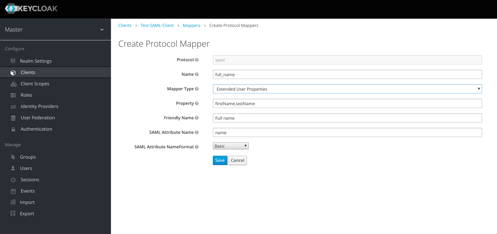

# README #

 

### What is this repository for ? ###

* Quick summary
    * Keycloak SAML Protocol Mapper SPI
* Version
    * 0.0.1

### Who do I talk to ? ###

[Serhii Shymkiv](mailto:sergey@shimkiv.com)
